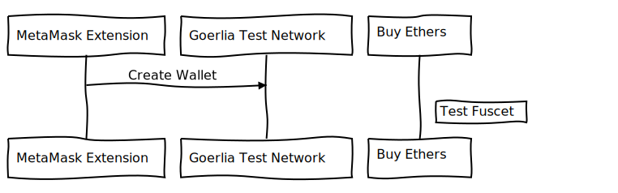
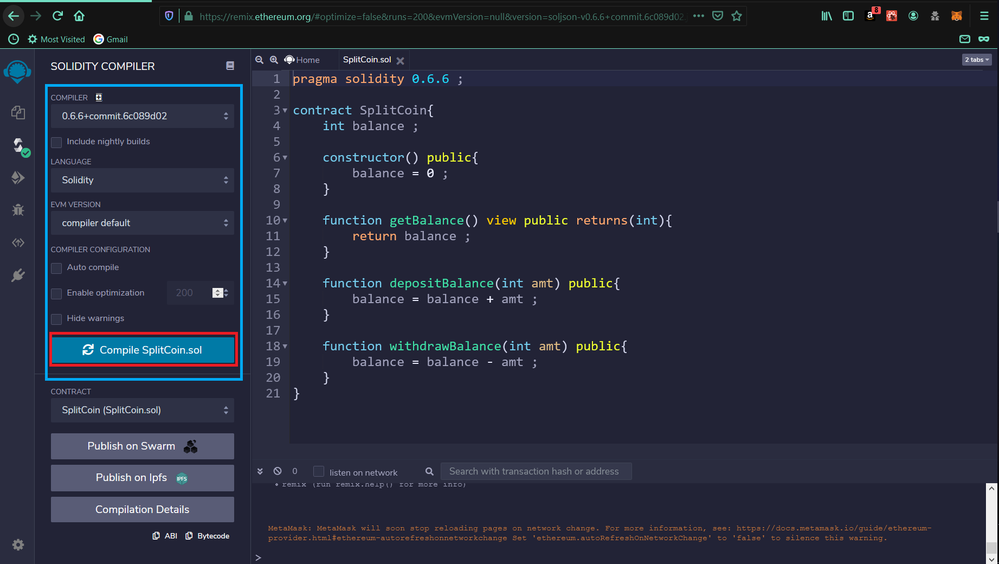
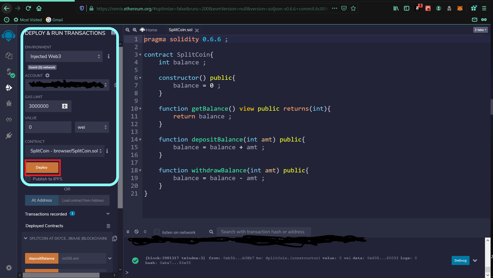
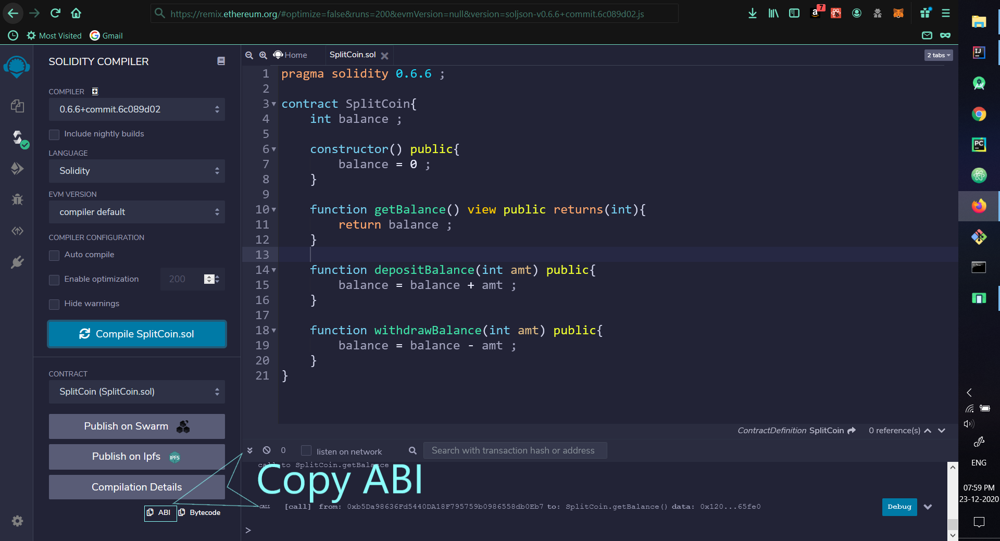
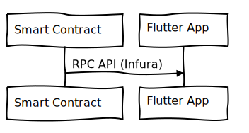
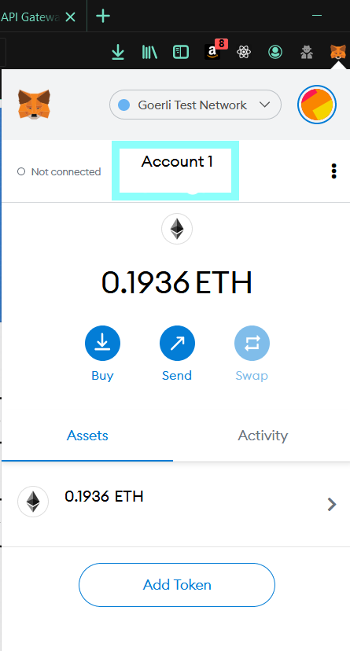
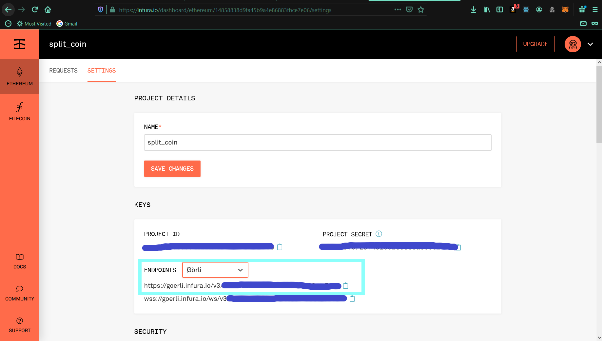
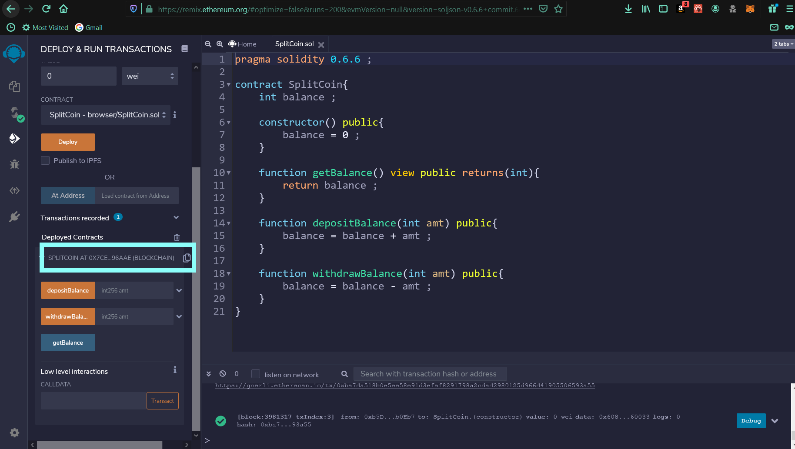
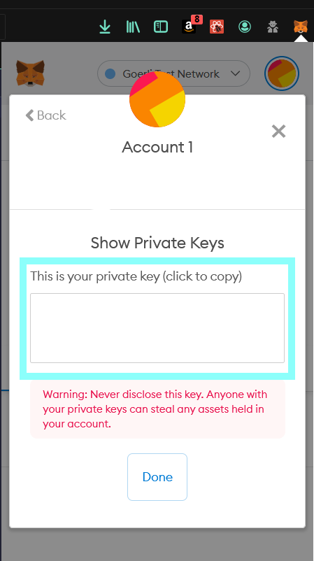

# Split Bit

- A Blockchain based basic project, which focuses on interacting with the smart-contract via web3dart in flutter.

## Preview

## Initial Setup
- Meta-Mask, Chrome Extension installation.
- Infura to connect with the RPC server.
- Deployed Smart-Contract on Remix-Ethereum IDE.

## Setup Your Meta-Mask wallet.

##  Deploy SmartContract.
- Create Simple Smart-Contract using Solidity Programing Language via [Remix-Ethereum Ide](https://remix.ethereum.org)
- Just Copy/Paste the SmartContract code from `lib ➡ SplitCoin.sol`
- Compile it

- Deploy it

- Copy ABI

- Paste ABI in out project as, `assets/abi.json`

## Infura
- Create your account on [infura](https://infura.io/)

---

## ether_splitter.dart
- Add appropriate credentials, as mentioned by comments.

| //Paste your MetaMask address |  |
| ---------------------------- | ---------------------------- |
| //Paste Your Infura Test API EndPoint link |  |
| //Paste the deployed contract address from Remix IDE |  |
| //Export the meta mask private key and paste here |  |

## Thats it !

